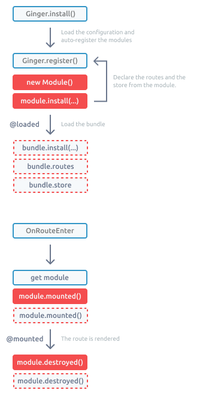

# Ginger

> ## A UMD module loader and handler. Allows you to create a distributed web application.


## Overview

Ginger provides you with the framework to create Vue.js distributed applications that are modular and lazy-loaded. Applications with modularity in mind decrease the number of items loaded at boot time and, at the same time, increase the response time.

Every module is packed (chunked or not) with a set of views rendered via routing or the use of the `ginger-view` component. A module is fetched on the fly or before the application's initial rendering from a CDN via HTTPS, thus allowing better cache retention. 

This approach has multiple advantages. 
Amongst them:

- It optimizes the bandwidth usage;
- It allows a better distribution of work. Allowing distributed work; 
- The versioning aims at almost zero downtime when going to production as it is just a matter of updating the version in use. It also allows keeping a client in a specific version if needed. 


## The Host

As the master of the system, the VueJS Application will host and orchestrate all the modules via the Ginger VueJS Plugin. 

It has multiple responsibilities:

- Provide the context for the application to be executed (provide the capabilities, middlewares and plugins mechanism);
- Prepare the application to be in a usable state (e.g. load all the modules manifest) while informing the user about the progression and failure of this execution if needed.  

### Setup

1. Installing the Ginger VueJS plugin is easy as:

```shell
yarn add @spices/ginger
```


2. Now you can install it in the VueJS Application

```js
import { GingerModuleConfig, VueGinger } from @spices/ginger

app.use(VueGinger, {
    eventbus: <Vue>?,
    loader: <VueComponent>?,
    logger: <CayenneLogger>?,
    middlewares: Array.<GingerMiddleware>?,
    modules: Array.<GingerModuleConfig>?,
    options: <Object>?,
    plugins: Array.{ options: <Object>?, plugin: <Function> }>?,
    router: <VueRouter>?,
    store: <Vuex>?,
    transports: Array.<iTransportation>?
});
```

| `eventbus`    | The event bus for the application. If none provided, a default one will be created. |
| ------------- | ------------------------------------------------------------ |
| `loader`      | A component to use to display the loading state of the application. |
| `logger`      | [The logger](https://github.com/alexandremasy/spices-cayenne) to use in the modules. |
| `middlewares` | A list of middleware to use in order to set up the application. |
| `modules`     | List all the modules to use in the application.              |
| `options`     | A custom options object that allows you to pass data to all the modules like a global configuration. |
| `plugins`     | List all the plugins to use in the application.              |
| `router`      | An instance of `VueRouter`.                                  |
| `store`       | An instance of `Vuex`.                                       |
| `transports`  | The collection of available transport for all the modules.  E.g. A configured instance of the `Axios` library to make HTTP call. |

 

3. Add the `ginger-router` in your main view (instead of the default `view-router`).

```js
<template>
	<ginger-router-view />
</template>
```


### Flow

From the time VueGinger is installed to the time, everything is up and running a whole lot can happen. Here is an overview of this orchestration and all the events available to be hooked. While the application is in setup (before the `ginger:ready` event is triggered) the `loader` component is displayed.  Once it is ready, a `vue-router` component is rendered in place of the loader. Every view is then loaded based either on the route or the request via the `ginger-view` component. 


During the whole process, a bunch of hooks either via the event bus or through the `GingerModuleManifest` are available. 

**Ginger Hooks**

| **Event**       | **Description**                              |
| :-------------- | :------------------------------------------- |
| `ginger:create` | Triggered when Ginger starts its setup       |
| `ginger:ready`  | Triggered when Ginger has complete its setup |


**Plugins Hooks**

| **Event**                 | **Description**                        |
| :------------------------ | :------------------------------------- |
| `ginger:plugins:start`    | Triggered when the plugin setup starts |
| `ginger:plugins:complete` | Triggered when the plugins are ready.  |


**Middlewares Hooks**

| **Event**                     | **Description**                                   |
| :---------------------------- | :------------------------------------------------ |
| `ginger:middlewares:start`    | Triggered when the middleware setup starts.       |
| `ginger:middlewares:complete` | Triggered when the middleware setup is completed. |


**Modules Hooks**

| **Event**                 | **Description**                                         |
| :------------------------ | :------------------------------------------------------ |
| `ginger:modules:register` | Triggered when a module register.                       |
| `ginger:modules:routes`   | Triggered when the routes from a module are registered. |
| `ginger:modules:stores`   | Triggered when the stores form a module are registered. |


**Views Hooks**

| **Event**              | **Description**                                              |
| :--------------------- | :----------------------------------------------------------- |
| `ginger:view:before`   | Triggered when the `GingerView` has been found before the loading check has been done. |
| `ginger:view:progress` | Triggered when the `GingerView` is being loaded.             |
| `ginger:view:load`     | Triggered when the `GingerView` is loaded.                   |
| `ginger:view:mount`    | Triggered when the `GingerView` is mounted.                  |
| `ginger:view:destroy`  | Triggered when the `GingerView` is destroyed.                |


### Loader

Provide a component to be displayed while the Ginger Application is being setup. 
If no component is provided:

- but the Pepper components are available, then the `ui-loader` will be used.
- A white screen is presented to the user. 


### Middlewares

Allows installing the application requirements in order to work properly. While all the middlewares are running the global loader is displayed (if defined). The middlewares are executed synchronously in the order of declaration. Each middleware must return a Promise. When resolved, the next one can be executed. 

```js
import { bootstrap } from './middlewares'

app.use(VueGinger, {
  middlewares: [ bootstrap ]
})
```

```js
export default function({capabilities, modules}){
  return new Promise((resolve, reject) => {
    resolve()
  })
}
```


## Modules

At the heart of this whole logic, the modules reside.

### From the plugin

```js
import { GingerModuleConfig, VueGinger } from '@spices/ginger'

app.use(VueGinger, {
  modules: [ 
    new GingerModuleConfig({ ... }), 
  ]
})
```


### From the API

```js
this.$ginger.register( new GingerModuleConfig({...}) )
```


### GingerModuleConfig

Allows you to declare a new module to Ginger. It accepts the following arguments.

| `enabled = true` *Boolean*         | Whether or not the module is enabled.                        |
| ---------------------------------- | ------------------------------------------------------------ |
| `fqn` *String - **Required***      | A fully qualified name for the module. Will be used throughout the logic as a unique identifier. |
| `name` *String*                    | A convenient name.                                           |
| `manifest` *String - **Required*** | The URL where to load the manifest.                          |
| `options` *Object*                 | The module options.                                          |


### Plugins

Integrate plugins into the whole installation mechanism to extends the feature set of Ginger like handling header metadata or body class.

```js
import { GingerHeadPlugin } from '@ginger/head'

let opts = {
  key: 'ABC'
}

app.use(VueGinger, {
  plugins: [{ options: opts, plugin: GingerHeadPlugin }]
})
```

```js
export default function({capabilities, options}){
  return {
    components: Array.{<name>:<VueComponent>}?,
    mixin: Function({capabilities, options}):<Object>?
  }
}
```

#### Head

Allows the customisation of the head directly from a `GingerView` component. Only the view linked to a route are allowed to change the head (by design. - You don’t want to check all the component active in a large application). 

In your Vue component add a `head` entry with the property you want to update. 

```js
<script>
export default {
  name: 'Awesome Listing`,
  head: {
    title: 'Waving the world',
  },
  
  props: {},
  computed:{},
}
</script>
```

Where the property is 

```
1property: <String> || <Function> || <Object> 
```

When it is an `object` it can have the following properties

| `join = ' - '` *String*        | When there are multiple views displayed (sub-routes) the values are joined by the value defined in this property. |
| ------------------------------ | ------------------------------------------------------------ |
| `name` *String -* **Required** | The name of the property. e.g. `title`                       |
| `replace = false` *Boolean*    | Whether to replace or concatenate the multiple values (for sub-routes). When set to `true`, only the first route with value is used. When set to `false` the values are joined. |
| `value` *Any - **Required***   | The value to use. If the value is not valid then the value will be discarded. |

 

**Trigger an update from the view**

```
this.$ginger.eventbus.$emit('ginger:head:update');
```


---


## Modules

The modules declared in the configuration files or the configuration `array` are auto-registered with the `register` method once the configuration file loaded and parsed. All the modules follow the ES2015 module definition and are build to be loaded from an HTTP request. Only the `default` module will be used during the registration. 

It is also possible to register a module via a call to the `register` method:

```js
Ginger.register(fqn, url, options*)
```


The configuration `file`, `array` or the register methods accepts the following options:

```js
{
  "enabled": true.<Boolean>,
  "fqn"*: <String>,
  "router: {
    "prefix": <String>
  },
  "url"*: <URL>
}
```

| `enabled = true` <br />*Boolean* | If true, the module will be enabled and therefore loaded. if not, the module will be ignored. |
| -------------------------------- | ------------------------------------------------------------ |
| `fqn` <br />**Required**         | The fully qualified name of the module. e.q. `io.infinity-mobile.barca.products` |
| `router.prefix` <br />*String*   | Prefix all the routes of the module with the given string.   |
| `url` <br />**Required**         | The module URL to be loaded from.                            |


Each Ginger module is autonomous and in charge of its own processes. It exposes a set of features for an application to use. A module must be optimized to include the minimum set of features and be light as possible while generic for multiple use cases. 

@spices/ginger will load the module via an HTTP request and then instantiate the module lifecycle. This one will evolve based on the navigation (defined by the module routes). 


## Anatomy

The features of a bundle will vary based on the final application needs but not its anatomy. Each module exports a default ES2015 JSModule that is an instance of a class that implements the `IGingerModule` interface.   

```js
interface IGingerModule{
  get routes():Array<VueRoute>
  get stores():Array<VueXStore>
  install({capacities, fqn, options})
  run({action})
}
```

**get routes**

The bundle will expose all its routes via a property named `routes`. 

```js
routes:Array.<Routes>
```

 

**get stores**

The bundle will expose its store or stores via a property named `stores`.

```js
store:Array.<Store>
```

 

**Install**

Called during the module registration. The method `install` will be called on the bundle with the following attributes:

```js
install({capacities, fqn, options});
```


| `capacities` <br />*Object* | The capacities of the module.                                |
| --------------------------- | ------------------------------------------------------------ |
| `fqn` <br />*String*        | The module FQN.                                              |
| `options` <br />*Object*    | The module configuration as defined during the registration. |

**where capacities =**

| `eventbus` *Vue*                         | The modules event communication pipeline. Listen for events with `$on`, `$once`. Trigger events with `$emit`. |
| ---------------------------------------- | ------------------------------------------------------------ |
| `logger` *CayenneLogger*                 | The logger instance configured for the module.               |
| `parent` *Ginger*                        | The ginger instance.                                         |
| `transport = [http]` *Array<iTransport>* | The list of available transport available for the data layer calls. |
| `router` VueRouter                       | An instance of VueRouter.                                    |
| `store` *VueX*                           | The instance of the VueX store. It allows access to all the store bells and whistles. |


**Run**

Execute a method on the bundle. 

```js
run({action});
```

**Mounted**

On route enter the `mounted` method is call on the bundle. 

```js
mounted({route})
```

| `route` | The current route |
| ------- | ----------------- |


## Lifecycle

Inside an application, the bundle will follow the following lifecycle.



